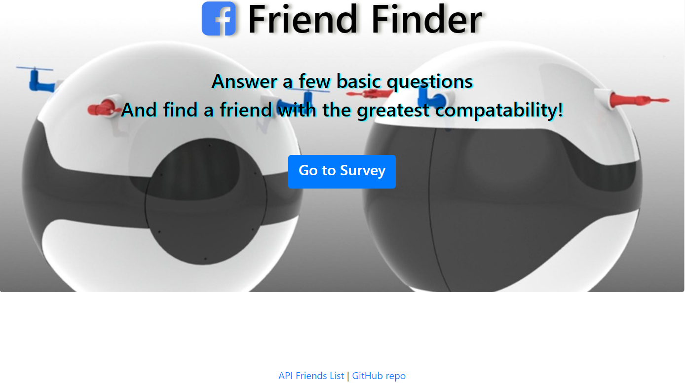
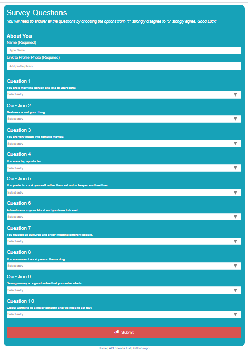
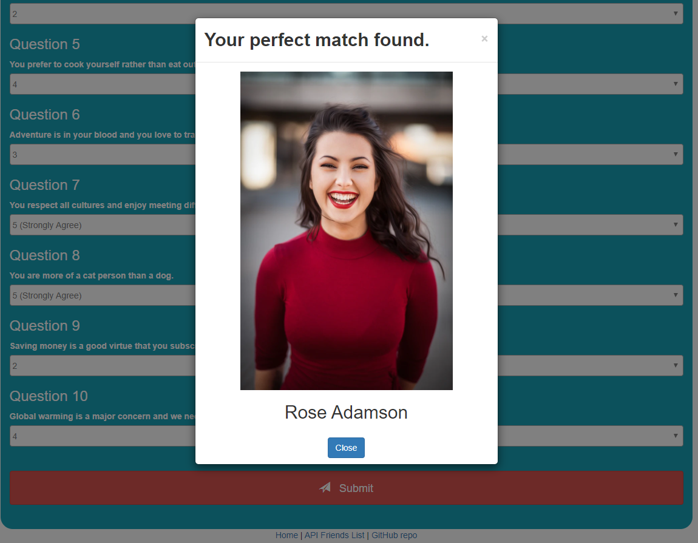
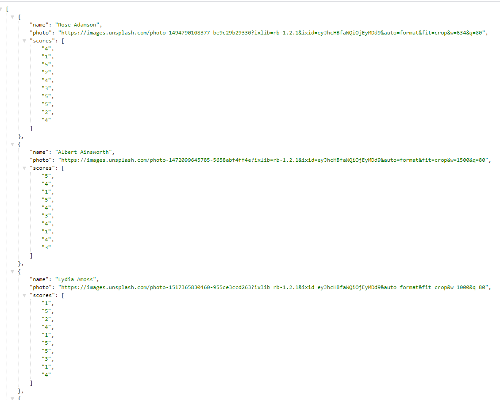

# FriendFinder
A compatibility-based "FriendFinder" application using Express to handle routing and deploying it on Heroku.

## link to Live Website
The web page survey app is assessible on the attached link:

https://friend-finder-jgoh.herokuapp.com/

## Instructions
The home page will allow you to navigate to the survey form or enter the JSON api friends page.

Once you enter the survey page, you will be required to enter your name and attached a profile photo. You will need to enter all ten questions with an option from strongly disagree (1) to strongly agree (5). 

After submitting the survey, you will be provided with a best match from our database.

There will be a navigation tool below the pages to either return to the home page, api friends data or github repository.

## Technologies Used

- JavaScript
- jQuery
- node.js
- Express.js
- HTML
- Bootstrap

Note: this work has been added to my portfolio page in my bio.
[MyPortolio](https://jgohbb.github.io/Portfolio-JGoh/portfolio.html)